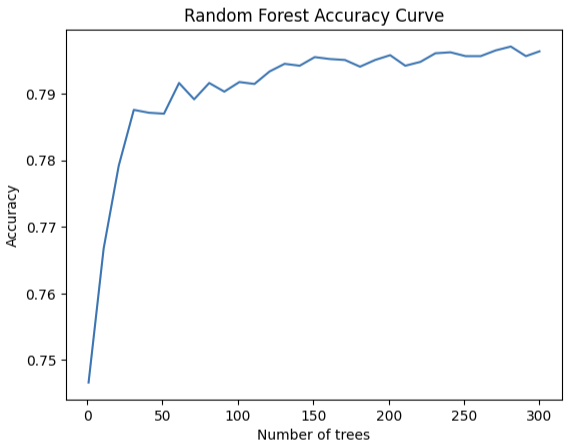
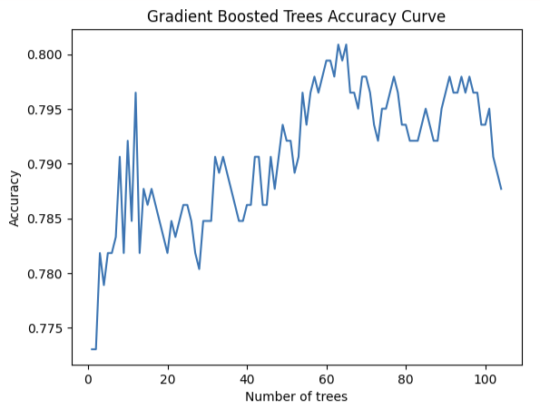

### SpaceShip Titanic Supervised Machine Learning Project: CSCA 5622 ###
For my Final project I am going to execute a supervised learning analysis on a kaggle data set https://www.kaggle.com/competitions/spaceship-titanic/data <br>
Here I am using the "Spaceship Titanic" data from an ongoing Kaggle competition where we will predict which passengers are transported to an alternate dimension.
This project includes 3 deliverables: 
* This Juypter notebook - including: problem Decription, EDA procedure, Analysis (model building and training), Result, and Discussion
* A video presentation available on Youtube - Explaining what problem we solved, my ML approach and method, and Final Result
    * https://youtu.be/kR7RFkoWamU
* and a public github repository - https://github.com/GHeart01/SpaceShip-Titanic-Supervised-ML-Project

#### Table of Contents

- [Problem Description](#Problem-Description)
- [Analysis](#Analysis)
- [Result](#Result)
- [Discussion](#Discussion)
- [Citation](#Citation)
#### Problem Description
First lets take a brief overview of our Machine Learning (ML) problem. In this scenario we explore a play on a well known disaster, The Titanic, in which a "ground truth" for each passenger is determined. Our goal is less gruesome, as instead of life and death on the spaceship tianic we will determine whether almost 13,000 passengers on board will be transported to three habitable exoplanets orbiting nearby stars. Unfortunately while rounding our first destination, the Spaceship Titanic collided with a spacetime anomaly. While the ship stayed intact, almost half of the passengers were transported to an alternate dimension!  
<div align="center">
  
    <br>
Spacetime Anomaly
</div>

To resue the lost passengers we must use Machine Learning to predict which passengers were transported by the anomaly using records recovered from the spaceship's damaged computer system! <br>

<b> GOAL: For each passenger, predict either <i>True<i> or <i>False<i> for which the passenger was transported off the Spaceship Titanic<b>


### Exploratory Data Analysis (EDA) Procedure
My task is to predict whether a passenger was transported to an alternate dimension during the Spaceship Titanic's collision with the spacetime anomaly. To help  make these predictions, I use a given a set of personal records recovered from the ship's damaged computer system.

|Variable |	Description|
|:---------|:-------------|
|PassengerId 	|A unique Id for each passenger. Each Id takes the form gggg_pp where gggg indicates a group the passenger is travelling with and pp is their number within the group. People in a group are often family members, but not always.|
|HomePlanet |	The planet the passenger departed from, typically their planet of permanent residence.|
|CryoSleep |	 Indicates whether the passenger elected to be put into suspended animation for the duration of the voyage. Passengers in cryosleep are confined to their cabins.|
|Cabin |	The cabin number where the passenger is staying. Takes the form deck/num/side, where side can be either P for Port or S for Starboard.|
|Destination |	The planet the passenger will be debarking to.|
|Age| 	 The age of the passenger.|
|VIP |	Whether the passenger has paid for special VIP service during the voyage.|
|RoomService, FoodCourt, ShoppingMall, Spa, VRDeck |	Amount the passenger has billed at each of the Spaceship Titanic's many luxury amenities.|
|Name |	The first and last names of the passenger.|
|Transported |	Whether the passenger was transported to another dimension. This is the target, the column you are trying to predict.|

### Analysis
I used pandas and numpy for data cleaning and EDA. Matplotlib for plotting to visual inspect data that could be related to our goal, statsmodel, sklearn,scipy, and TensorFlow to model data and determine accuracies. My EDA involved an initial test of reading the data, and a quick look using “.head”, “describe”, and “.info” to determine datatypes of our variables, as well as a look at passengers who were transported. I then used bar and histogram plots to gain a visual of passengers who were transported, and performed data cleaning and data restricting based on tables using “.drop” and “.head”. <br>I created a copy of the data and plotting a heatmap correlation where I found high positive correlation between “Transported” and “CryoSleep”, and high negative correlation with “VRDeck”, “Spa”, and “RoomService”. I then used a pairplot to confirm my visual aid. Then I created bbox and KDE plots for relations between Transported and “VRDeck”, “Spa”, and “RoomService”, and “CryoSleep”. I then adjusted the data for use in Tensorflow and plotted based on Random Forest and Gradient Boosted Method. These methods accurately determined whether a passenger had been transported nearly 80% of the time. In an attempt to push further, I tried a Logistic Regression, which produced an accuracy of about 76%.

<div align="center">
   
    <br>
Random Forest Vs. Gradient Boosted Machine</div>
### Result
After exploration of the data, data cleaning, and variable management (in the case of "cabin"), we see an accuracy of roughtly 80% success across our models, with RF performing as the most accurate model for finding the missing passengers. "Spa", "VRDeck", "RoomService", and "CryoSleep" all heavily weiged whether a passenger would be transported or not. In addition, by converting non integer type data variables to integer types, thus making all the data numeric, it made it much more determinable to find out whether a passenger had been transported via a 0 (False) or 1 (True). My result is the Random Forest method was the possible accurate at determining whether a passenger was missing or not.
### Discussion
I targeted "Spa", "VRDeck", "RoomService" as variables to use for finding the missing passengers. While I did not include other variables in the notebook, I did attempt the models using additional variables to see how the models would perform; and no additional variables ever increased accuracy. I utilized boxplots and KDEplots to confirm my visual assumptions from the the heatmap. In addition I used a pairplot to gain additional validation of correlations from transported passengers and other variables. These decisions were aided on my inital EDA and plotting of possible demographics affected by the anomaly.
From my models, Random Forest and Gradient Boosted Machine performed well. Both models performed at around 80%. Logistic Regression performed noticably worse at around 76% accuracy, which isnt bad, but is certainly worse. There is certainly room for contest of my result as I utilized libraries from tensorflow for RF and GBM, while I used Sklearn for the Logistic Regression. I would have used TF for all tests, but there were issues getting the training data into proper tensors for arrangement. Overall, I am happy with my models and believe, but believe there are improvements that can be made.
### Citation
Addison Howard, Ashley Chow, and Ryan Holbrook. Spaceship Titanic. https://kaggle.com/competitions/spaceship-titanic, 2022. Kaggle.

### Clone this repo
```bash
git clone https://github.com/GHeart01/SpaceShip-Titanic-Supervised-ML-Project.git
